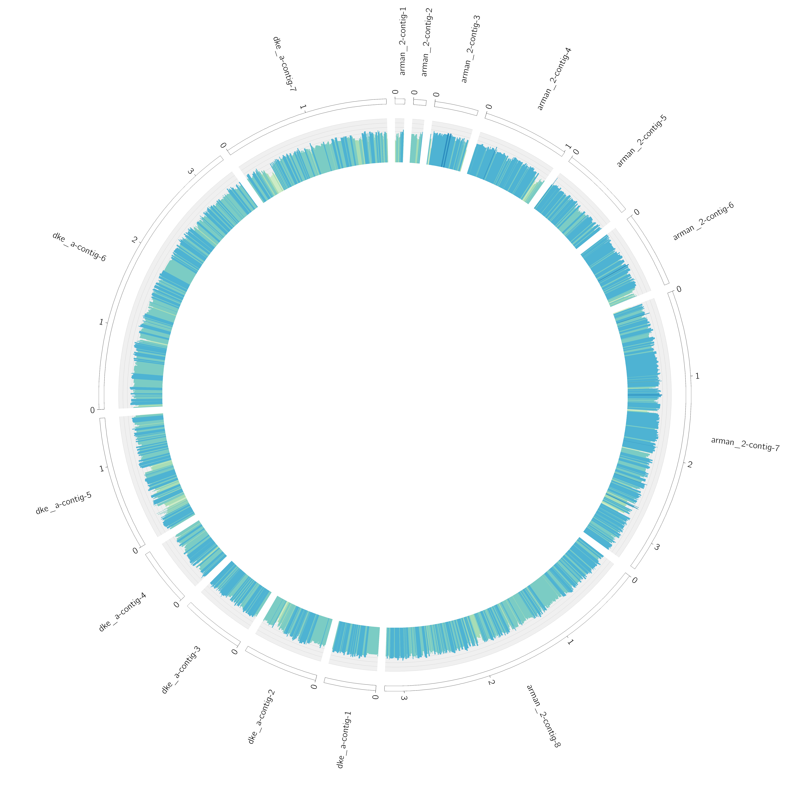

# :doughnut:  Donut

just a simple tool that generates a circos plot from a bunch of fasta files

# usuage
1. clone this repo `git clone https://github.com/philippmuench/Donut.git`
2. put your fasta (one or multipe) files in the `data/genomes/` folder
3. add your Hidden Markov model file to `data/hmm/model.hmm`
4. start the docker container `docker run -v /absolute/path/to/data/folder:/data philippmuench/easycircos`
5. inspect the output written to `data/output/`

# example output


from outer to inner:
- filled dots: CDS, unfilled dots: hypothetical CDS
- GC content
- hits to `data/hmm/model.hmm` based on hmmsearch against ORFs

# development

comment the entrypoint in `Dockerfile` out than build the docker image from scatch

```
sudo docker build -t easycircos .
```

then start in interactive mode

```
sudo docker run -it -v /home/pmuench/github.com/philippmuench/easycircos/data:/data easycircos
```

inside the docker image start the tool

```
./start.sh
```

The error print to screen are not critical, becaused the hmmvis tool tries to export png image to the screen which is not possible within docker. 

You can also change `data/config/circos.config` file from outside the container (because its mounted to the image) and run the circos step only to update the output file 

```
./start_circos.sh
```
