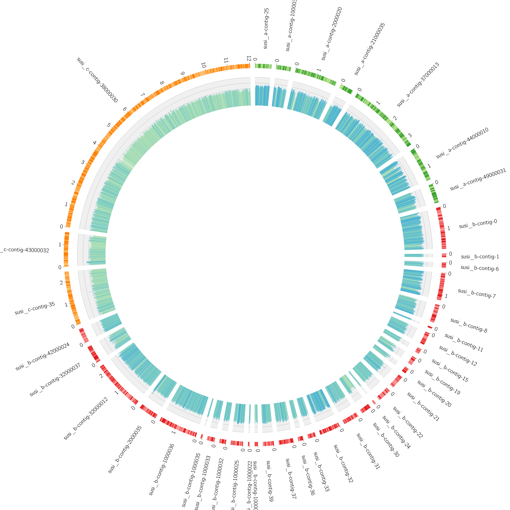

# easycircos

Just a simple tool that generates a circos plot from a bunch of fasta files.

# usuage
1. clone this repo `git clone https://github.com/philippmuench/easycircos.git`
2. put your fasta (one or multipe) in the `data/fasta/` folder
2. start the docker container `docker run -v /absolute/path/to/data/folder:/data philippmuench/easycircos`

# what happens inside the image
1. ORF identification of fasta files with prodigal
2. automated generation of the circos.conf file
3. hmmsearch based on ORFs and provided hmm model (under development)

# output

# acknowledgment
this docker container is based on the image from dennishazelett.
